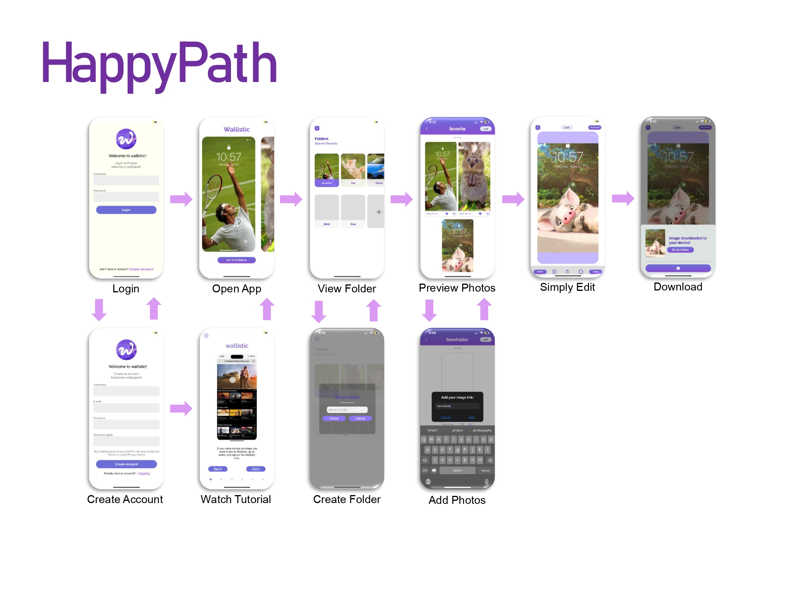
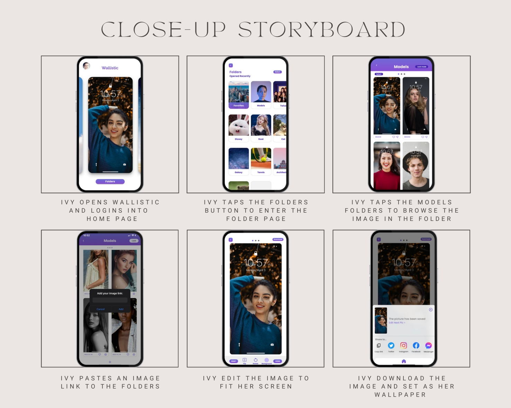
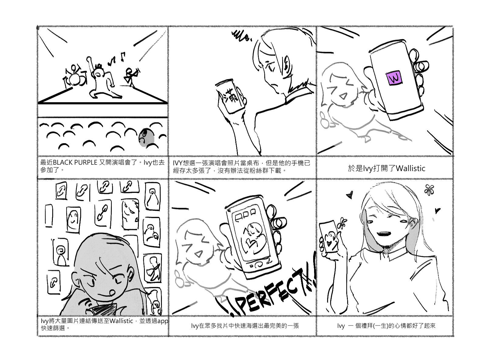

# Wallistic

Wallistic is a mobile application designed to help users efficiently find and set suitable wallpapers for their mobile devices. The app aims to reduce the time and storage space users typically spend on choosing and managing their device wallpapers.

## Features

- Pin and save image URLs from various web pages
- Categorize and organize saved images into folders
- Preview images as wallpapers or lock screens before applying
- Basic image editing capabilities (rotate, flip, crop, adjust)
- Download edited or original images
- Save editing parameters for future use

## Development

Wallistic is developed using React Native and Expo, allowing for easy development and testing on both iOS and Android devices.

## Figma Prototype: 

- [Light Mode](https://www.figma.com/proto/v0NciO6hnoA7JuotXtXol1/DEMO2?type=design&node-id=2013-12994&t=dBF4FRnBTIUGCaLC-9&scaling=scale-down&page-id=1011%3A3346&starting-point-node-id=2013%3A12994&show-proto-sidebar=1)

- [Dark Mode](https://www.figma.com/proto/v0NciO6hnoA7JuotXtXol1/DEMO2?type=design&node-id=2013-13109&t=rBOrnFrh3cQDRdX6-9&scaling=scale-down&page-id=1011%3A3346&starting-point-node-id=2013%3A13109&show-proto-sidebar=1)

## Team

Wallistic was developed by a team of 5 members

## Wallistic App Feature Demos Video

(Adjust the video picture value to 720 to make the video clearer)
  
- [Create account or login](https://drive.google.com/file/d/1kWUgL0CWFrdEpIgBRkYzRu5VtG9fN-P1/view?usp=sharing)

- [Add folder and add image](https://drive.google.com/file/d/13Rcu7A1eYtpw2hzPajMRDOuL--RPoyMy/view?usp=sharing)

- [Total pins will increment](https://drive.google.com/file/d/1A8LVBMkGTzF5m0Twaf_X3fFcabKSEbXH/view?usp=sharing)

  (Note: Below the profile picture, there will be a "Total pin" field representing the current number of pins.)

- [Add image to favorites](https://drive.google.com/file/d/1PVI1pCoLPXMJ3HcgD0ZtKlWP2x0Yln_d/view?usp=sharing)

- [Set dark mode](https://drive.google.com/file/d/1LVAVITIoHYfs-HvhGUGYyTccX1CRfEiv/view?usp=sharing)

- [Change preview mode](https://drive.google.com/file/d/1-ddIpPolJjnEsFf167THpHjDmUzLNo1i/view?usp=sharing)

- [Editing](https://drive.google.com/file/d/1VaH23nvVa1fxb8pPDdkHU3VHLMTIZ9BD/view?usp=sharing)

- [Download](https://drive.google.com/file/d/1N71meYuQrPN2UvRbqVODttQbfWYQ-zUQ/view?usp=sharing)

- [Share](https://drive.google.com/file/d/1xZMYefGsuKa-L3AxVXZ0yWxn2G3ffzM9/view?usp=sharing)

- [Storage](https://drive.google.com/file/d/17PFIs8vDPMXbh2y2TYcK1LvsFmFK20lA/view?usp=sharing)

  (Note: The preview and edit state of user-created folders can be preserved.)

## Reports

Detailed reports on the design and development process of Wallistic can be found in the following PDF files:

- [Demo 1 Report](./Project_details/demo1/Demo1_Report_Team07.pdf)
- [Demo 2 Report](./Project_details/demo2/Demo2_Report_Team07.pdf)

## Design Process

The development of Wallistic followed a user-centered design approach, involving the following steps:

1. User interviews and persona creation
2. User journey mapping
3. Ideation and solution generation using the Crazy 8s technique
4. UI design using Figma
5. Design critiques and improvements
6. Usability testing and iterative refinements

## Happy Path

## Close Up Storyboard

## Big Picture Storyboard

### Prerequisites

- Node.js
- Expo CLI
- Expo Go app (for testing on physical devices)

## Acknowledgements

We would like to thank our users for their valuable feedback and insights throughout the development process. Their contributions have been essential in shaping Wallistic into a user-friendly and efficient app.

